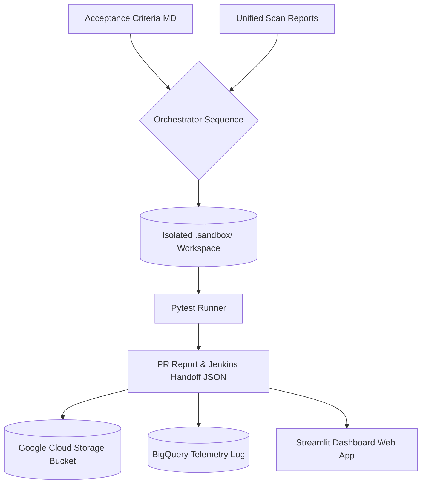

# CruiseMode Deep-Dive & Agentic Curriculum Alignment

This document outlines the detailed architecture, data flows, tech stack, and direct alignment of **CruiseMode** with the 5-Day Agentic Coding and Vibe Coding Curriculum.

---

## 📊 1. Data, Files, and Analysis Scale

### A. Data Scale
- **Scan Findings:** Processes **12 active security/quality findings** loaded from 4 scan reports (OWASP, SonarQube, Clean Code, OSS).
- **Telemetry Scale:** Tab 2 manages **50,000 historical validation run records** (run ID, timestamp, repository, status, patches, test results, execution duration) simulating a municipal codebase database.
- **Acceptance Criteria:** Parses **5 distinct acceptance criteria** from the feature request markdown.

### B. File & Code Scale
- **Source Target:** 1 target FastAPI microservice (`sample_app/`) containing:
  - `app.py` (FastAPI endpoints, log outputs)
  - `refund_service.py` (Core business logic, exceptions)
  - `models.py` (Data schemas)
- **Generated Code:** Auto-generates **3 test files** (`generated_tests/test_refund_api.py`, `test_refund_validation.py`, `conftest.py`) mapping to the parsed acceptance criteria.
- **Evidence Storage:** Generates **5 structured JSON/Markdown artifacts** in `outputs/` representing the PR package.

### C. Requirements & Acceptance Criteria Analysis
1. **Ingestion:** The `AcceptanceCriteriaAgent` reads [acceptance_criteria.md](file:///Users/susmithajejigari/cruisemode/inputs/acceptance_criteria.md) and translates natural language requirements into a structured JSON checklist.
2. **Matching:** The `ScanAnalysisAgent` parses tool scan reports (OWASP JSON, SonarQube, etc.) and maps vulnerabilities directly to source code lines.
3. **Patching:** The `SandboxPatchAgent` applies refactoring rules based on `config/patch_policy.yaml`. PII logging is masked, and broad exceptions are narrowed.
4. **Test Generation:** The `TestGenerationAgent` consumes the acceptance criteria checklist and writes automated `pytest` test cases.
5. **Validation:** The `ValidationAgent` executes `pytest` in the sandbox to verify that:
   - The original code requirements (AC) are met.
   - The newly applied security patches did not break business logic.

---

## 🏗️ 2. Execution, Storage, and Tech Stack

### The Tech Stack
- **Programming Language:** Python 3.9+ (Core business logic, tools, and agents).
- **Web Interface:** Streamlit (Visual diffing, live chatbot, Jenkins simulation).
- **AI Engine:** Google Gemini (1.5 Flash) via the official `google-generativeai` SDK.
- **Data Analytics:** Pandas & NVIDIA RAPIDS cuDF (Telemetry benchmark and speedup plots).
- **Containerization:** Docker (Lightweight Debian base, multi-command start).
- **Cloud Infrastructure:** Google Cloud Run (Hosting), GCS (Blob artifacts), BigQuery (Runs log DB).
- **Testing:** Pytest (Local validation execution).

---

## 🎓 3. Alignment with the 5-Day Agentic Coding Curriculum

CruiseMode was built from the ground up to embody the core principles of the 5-Day Agentic Coding curriculum:

### 🌅 Day 1: Introduction to Agents & Vibe Coding
*Master vibe coding workflows where natural language is the primary programming interface.*
- **CruiseMode Implementation:** System prompt templates in `config/prompts/` guide agent behavior using natural language definitions. Developers write natural language requirements in `acceptance_criteria.md`, which CruiseMode automatically translates into executable tests without manual coding.

### 🔌 Day 2: Agent Tools & Interoperability
*Integrate external APIs, code execution, and agent-to-agent communication.*
- **CruiseMode Implementation:** Agents communicate via a unified, mutable shared state. The pipeline hooks into external files, Git commands, the Gemini API, and spawns local sandbox subprocesses (`pytest`) to compile execution outcomes.

### 🧠 Day 3: Agent Skills
*Build personalized agents with state, memory, and skills playbooks.*
- **CruiseMode Implementation:** We created the [skills.md](file:///Users/susmithajejigari/cruisemode/skills.md) file, serving as a repository-wide skill set and boundary playbook for all future agents. Long-term state is preserved via telemetry logging in BigQuery.

### 🛡️ Day 4: Vibe Coding Agent Security and Evaluation
*Develop reliable agents by implementing rigorous testing, guardrails, and quality evaluations.*
- **CruiseMode Implementation:**
  - **Sandbox Isolation:** All code writes and test executions happen in a separate `.sandbox/` workspace. Source code is never modified without developer promotion.
  - **Hallucination Prevention:** The AI Advisor chatbot uses native `system_instruction` settings to restrict LLM answers to the 5 generated run artifacts.
  - **Quality Evals:** Implemented custom pytest evaluations in `tests/unit/test_status_rules.py` verifying status logic (blocked vs ready).

### ☁️ Day 5: Spec-Driven Production Grade Development
*Graduate local agents into a governed, scalable, and observable production-ready fleet.*
- **CruiseMode Implementation:** Containerized the dashboard using a custom `Dockerfile` and deployed the application to Google Cloud Run. Structured BigQuery analytics log validation metrics, and GCS buckets store raw audit evidence.
